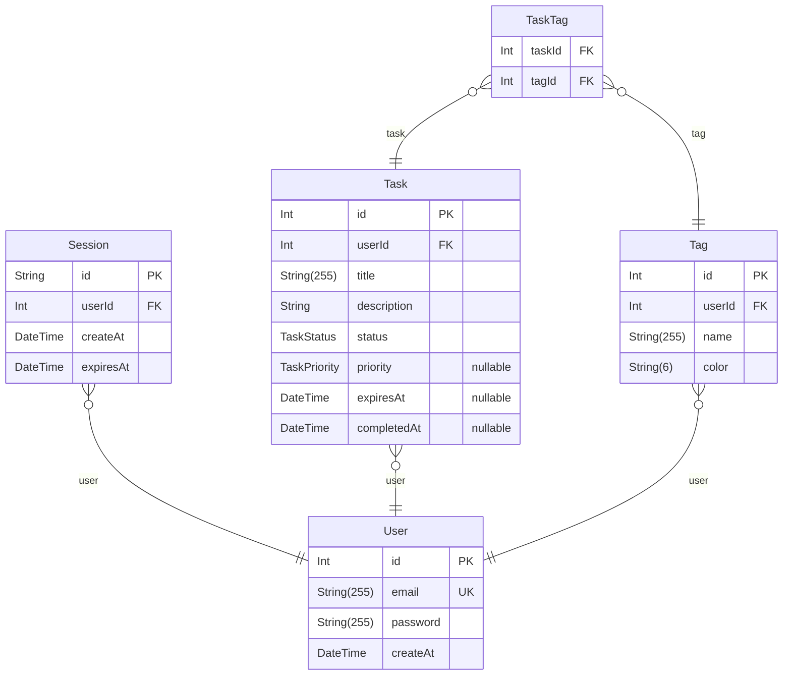

# Prisma Markdown

> Generated by [`prisma-markdown`](https://github.com/samchon/prisma-markdown)

- [default](#default)

## default

### `Session`

Properties as follows:

- `id`:
- `userId`:
- `createAt`:
- `expiresAt`:

### `User`

Properties as follows:

- `id`:
- `email`:
- `password`:
- `createAt`:

### `Task`

Properties as follows:

- `id`:
- `userId`:
- `title`:
- `description`:
- `status`:
- `priority`:
- `expiresAt`:
- `completedAt`:

### `Tag`

Properties as follows:

- `id`:
- `userId`:
- `name`:
- `color`:

### `TaskTag`

Properties as follows:

- `taskId`:
- `tagId`:
