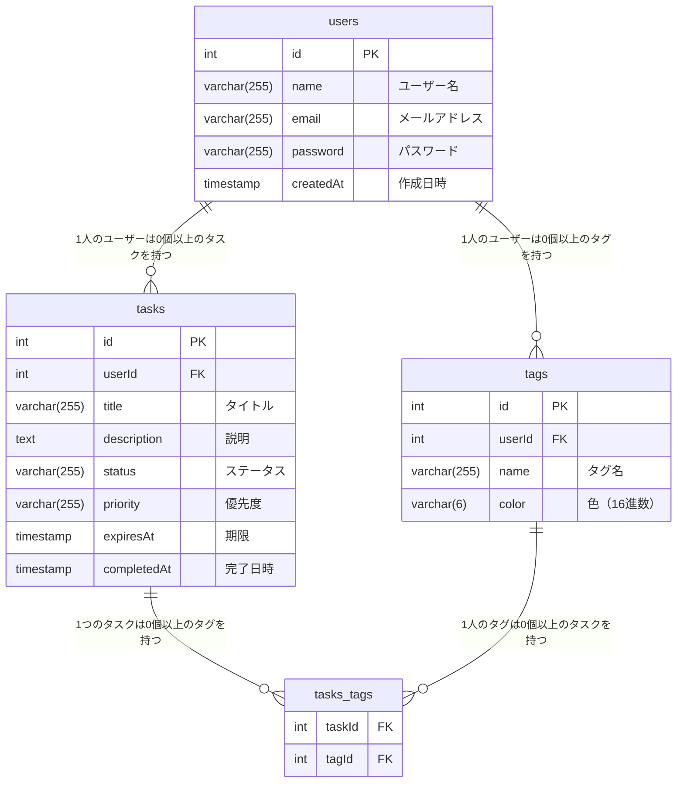

## memo

```mermaid
erDiagram

users ||--o{ tasks : "1人のユーザーは0個以上のタスクを持つ"
tasks ||--o{ tasks_tags : "1つのタスクは0個以上のタグを持つ"
tags ||--o{ tasks_tags : "1人のタグは0個以上のタスクを持つ"
users ||--o{ tags : "1人のユーザーは0個以上のタグを持つ"

users {
  int id PK
  varchar(255) name "ユーザー名"
  varchar(255) email "メールアドレス"
  varchar(255) password "パスワード"
  timestamp createdAt "作成日時"
}

tasks {
  int id PK
  int userId FK
  varchar(255) title "タイトル"
  text description "説明"
  varchar(255) status "ステータス"
  varchar(255) priority "優先度"
  timestamp expiresAt "期限"
  timestamp completedAt "完了日時"
}

tags {
  int id PK
  int userId FK
  varchar(255) name "タグ名"
  varchar(6) color "色（16進数）"
}

tasks_tags {
  int taskId FK
  int tagId FK
}


```

# aaaaaaa

## bbbbb

### ccccc

#### dddddd

##### eeee
